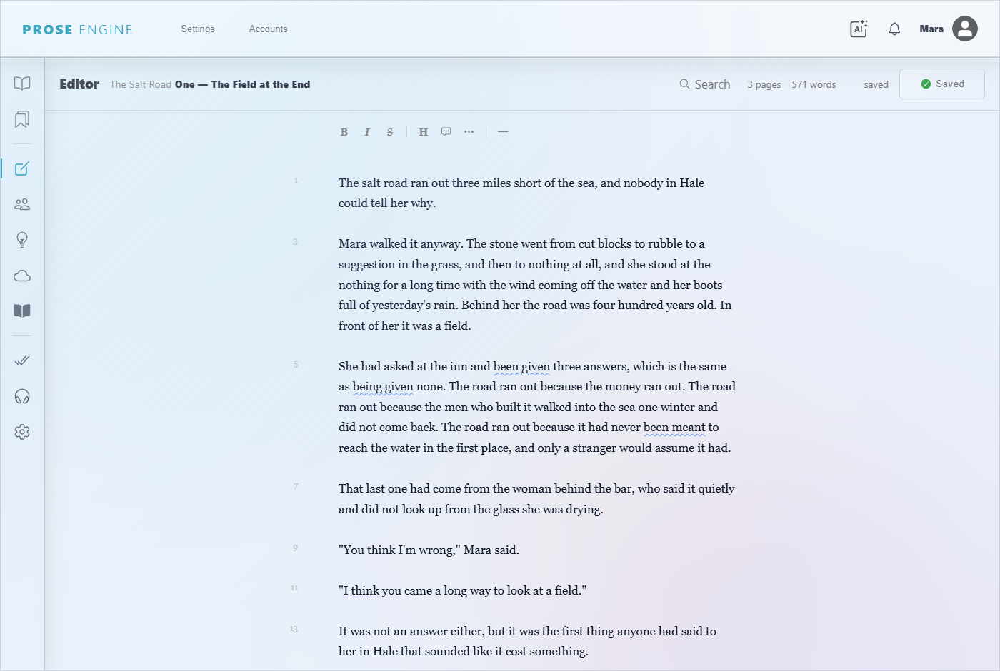
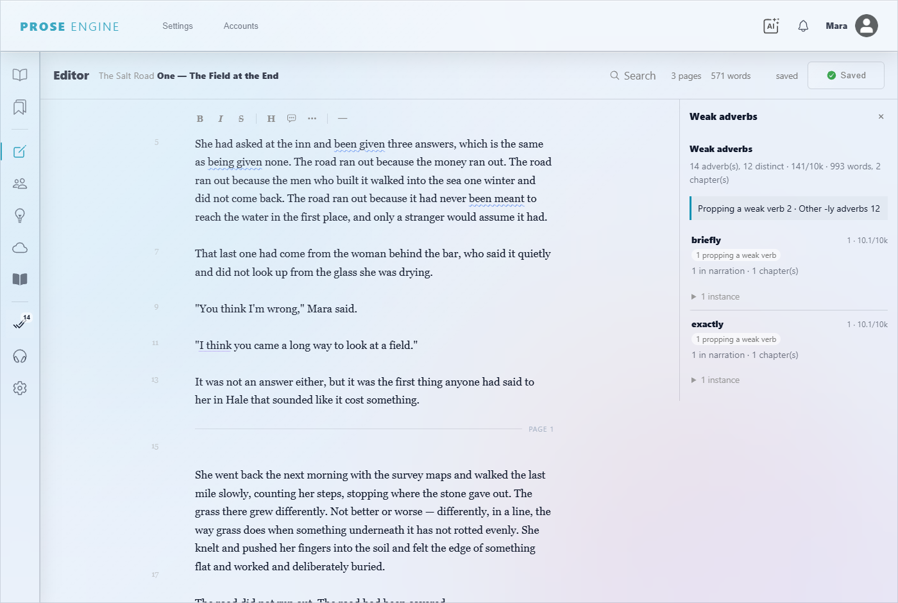
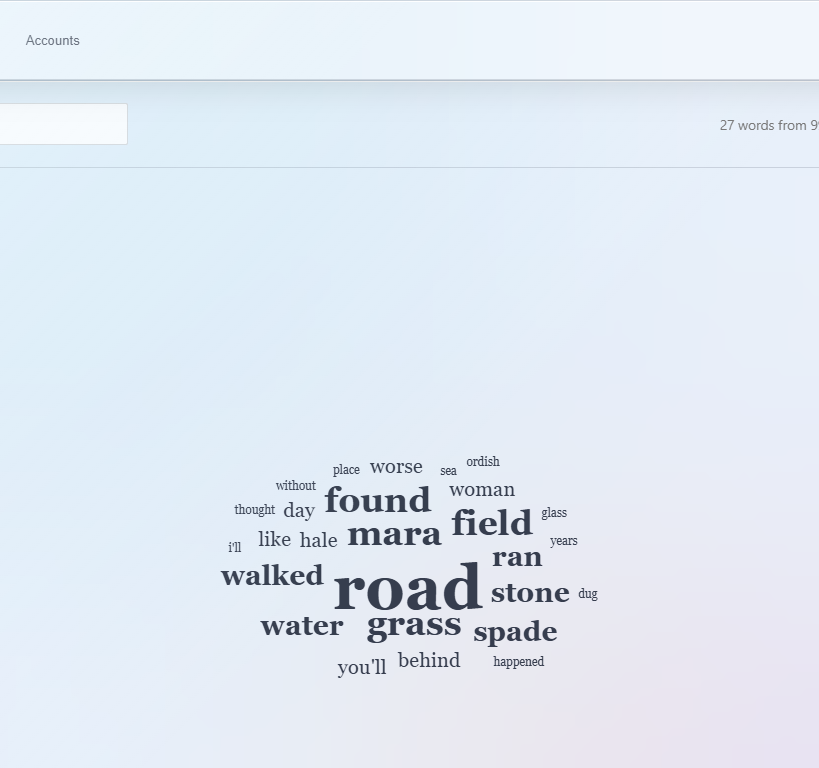
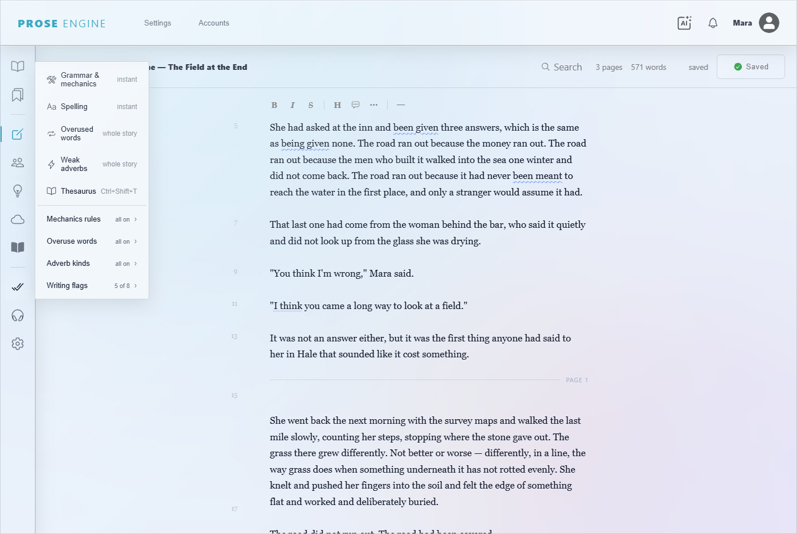
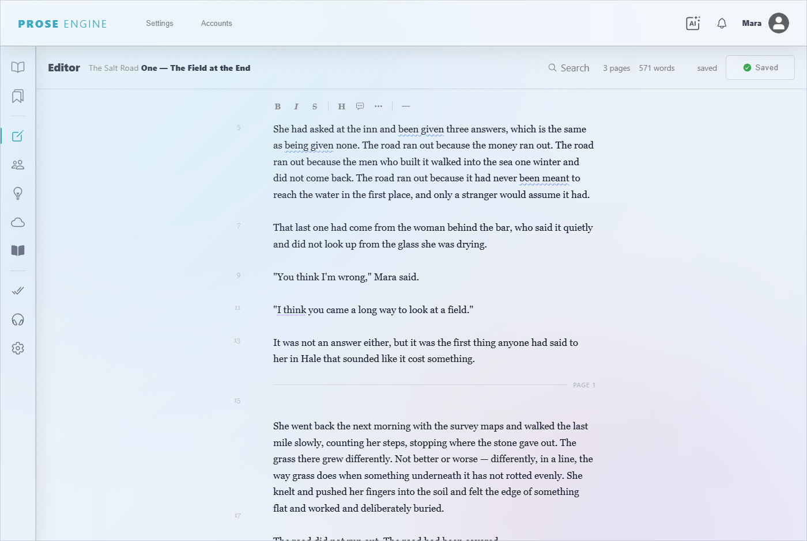
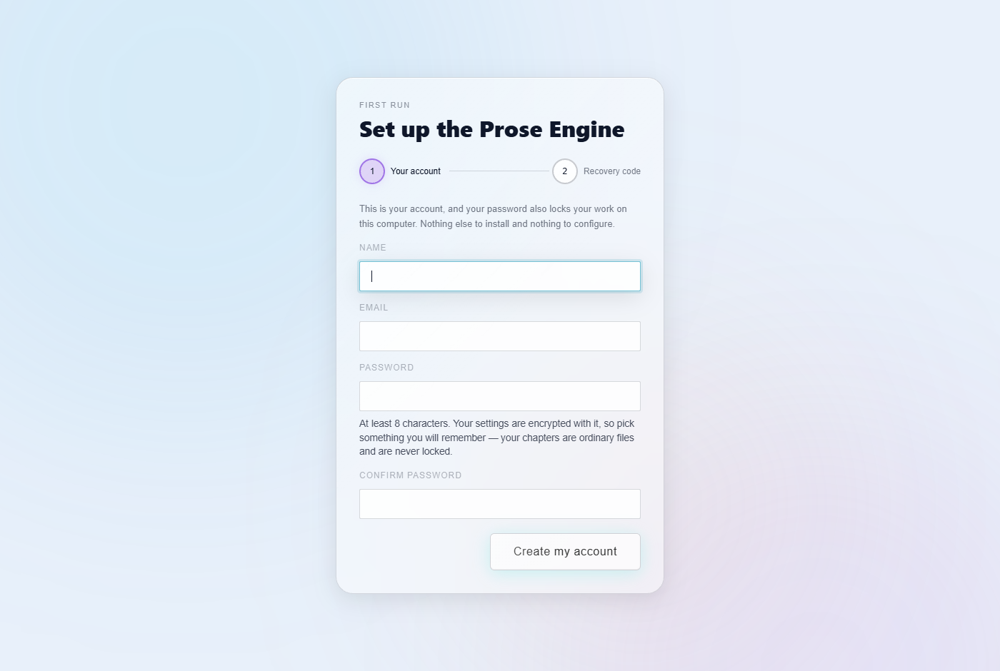

# Prose Engine

**A writing desk for novelists, that runs on your own computer.**

Prose Engine is for the part of writing that comes after the draft — the part
where you know something is wrong with a paragraph but not what. It reads your
manuscript and tells you specific, actionable things about it, then gets out of
the way so you can write.

Your chapters are plain Markdown files in a folder you choose. Not a database,
not a cloud account, not a proprietary format. If Prose Engine disappeared
tomorrow, every word you wrote would still open in Notepad.



---

## What it does

### It reads your prose and finds the things you can't see any more

**Weak adverbs — sorted by the edit, not counted.** Every tool on the market
tells you "412 -ly adverbs," which is roughly a measure of how long your book
is. Prose Engine sorts each one into the fix it actually represents:

- *redundant* — "whispered quietly." The verb already said it. Straight cut.
- *tag* — "said softly." The adverb is carrying what the dialogue should carry.
- *propping* — "walked slowly." A generic verb held up by a modifier; you want
  a better verb.
- *loose* — everything else, reported as a rate rather than a list of sins.

It reads your whole story to do it, because that's the only way to tell "Emily"
from an adverb, and it shows you the words it decided were character names so
you can check its work.



**Overused words.** Your crutch words, with the paragraph each one is in.

**The sensory scan.** Which senses a scene actually uses. Most drafts are all
sight and dialogue; this shows you where.

**The word cloud.** What your story is about, by weight — and you can hide words
that aren't interesting.



**Spelling and mechanics**, with a dictionary that learns your character names
instead of underlining them forever.

Every scan lives in one menu, and every one of these runs on your machine:



### It knows where the pages fall

A hairline across the page every 250 words — standard manuscript format — with
the page number on it, so you always know where you are. The breaks are
attached to the words, not to the window, so they stay put when you resize.
Nothing about them is written into your file.



### It reads your book out loud

A narrator that turns a chapter into audio, in a real voice, on your machine —
no account, no per-word pricing, no upload. Hearing your own sentences is the
oldest editing trick there is, and it catches things your eye has stopped
seeing. You can set music per chapter and export the result.

### It keeps your drafts safe

One-button backup of a story to a **private** GitHub repository. Private is not
a checkbox — repositories Prose Engine creates cannot be made public by it, on
purpose. Publishing an unfinished novel is the worst thing a backup button could
do, and it isn't one mis-click away.

### The AI is optional, and off

There is a second opinion available from Google's Gemini, and it is opt-in:
nothing leaves your computer unless you switch it on in Settings and supply your
own API key. Until you do, those features aren't even shown.

Everything above — spelling, mechanics, the adverb and sensory scans, the word
cloud, the narrator — runs offline and free. That's what makes the opt-in
honest rather than decorative.

---

## Why not just use Word?

Word is a typewriter that can check your spelling. It has no opinion about your
prose, because it can't see your prose — it sees characters.

Prose Engine knows what a chapter is, what a scene break is, which characters
speak, and which sentences are propped up by adverbs. It's the difference
between a spell-checker and a reader.

It also won't reformat your manuscript, lose your styles, or need you to
understand what a "style" is.

---

## Your work, your computer

- **Chapters are Markdown files** in a folder you pick. Back them up, edit them
  elsewhere, email them to your editor. They're just files.
- **Your settings are encrypted** with your password, so a copied or synced
  folder is unreadable without you.
- **Nothing phones home.** The only network call Prose Engine can make is to
  Gemini, and only if you turn it on.

### About that password

Your password does two jobs: it signs you in, and it unlocks your settings. That
means:

- Prose Engine asks for it each time you start the app. That isn't bureaucracy —
  it's the moment your data is decrypted.
- **If you forget it, you need your recovery code.** You're shown that code once
  when you set up, with a button to save it to a file. Save it.
- If you lose both, you set the app up again from scratch. **Your writing is
  untouched** — chapters are ordinary files and nothing here locks them. You'd
  lose your settings, not your novel.

### Uninstalling

Delete the folder. That's the whole procedure — the app keeps its data in a
`data/` folder beside itself, so nothing is left scattered around your system.
(If you used the installer rather than the portable build, uninstall it the
normal way and delete the data folder; **File → Where Is Everything?** in the
app tells you exactly where it is.)

Your story folder is yours and is never touched by any of this.

---

## Getting started

Prose Engine is a desktop app. You open it and write — there is no database to
install, no configuration file to edit, and no terminal.

1. Download the installer from the
   [Releases page](https://github.com/chefbennyj1/Prose-Studio/releases) and
   run it.
2. Create your account. **Save your recovery code** — the button on that screen
   writes it to a file, and it is the only way back in if you forget your
   password.
3. In Settings, choose the folder where your stories should live.

That's it.



> **Where this is today: beta.** There is an installer to download, and it
> works — it is what I write with. But it is early, the releases are marked as
> pre-releases for a reason, and things will still move. If you would rather
> wait for something that has been through more hands than mine, wait.

### Windows will warn you

The installer is not code-signed, so Windows shows **"Windows protected your
PC"**. Choose **More info**, then **Run anyway**.

That warning does not mean anything is wrong with the file — it means nobody
has paid for a signing certificate, which costs a few hundred pounds a year.
It is the same warning almost every small independent app produces.

### Updating

Download the newer installer and run it over the top. Your account, settings
and API key are kept — they live in your user folder, not inside the app, so
an update cannot touch them. Your manuscripts are not involved at all: they are
files in the folder you chose.

### Building it yourself instead

You need [Node.js](https://nodejs.org) (the "LTS" button), then:

```bash
npm install
npm run dist       # makes an installer and a portable .exe in dist/
```

Or run it straight from the source without packaging:

```bash
npm run app        # the desktop app
npm run dev        # just the server, at http://localhost:3100
```

---

## For developers

Node + Express, EJS views, a CodeMirror 6 editor, socket.io for live updates
when a chapter changes on disk, Kokoro/ONNX for offline speech, and Gemini
behind an opt-in gate.

There is no database. The app's records — accounts, settings, characters,
notifications — live in `data/`, one AES-256-GCM encrypted file per collection,
unlocked at sign-in by a key derived from the writer's password with scrypt. The
data layer in `services/db/` presents the slice of the Mongoose API this app
uses, so models and controllers read the way they always did.

- `electron/main.js` — the desktop shell: window, menu, data locations
- `services/db/` — the store: schemas, queries, encryption at rest
- `services/config/Vault.js` — password-derived keys, recovery codes
- `services/manuscript/` — chapters on disk, the watcher, search
- `services/proofing/` — the scans
- `services/narrator/` — text to speech
- `Agents.md` — the design decisions and *why*, at length
- `WORKING_PRACTICES.md` — how to work in this repo

```bash
npm run dev            # nodemon, port 3100
npm run app            # the Electron app against the source tree
npm run dist           # package installers into dist/
npm run build:editor   # rebuild the CodeMirror bundle
npm run screenshots    # retake the images in this README
```

`npm run screenshots` boots a throwaway instance with its own data folder and
its own demo story, so it cannot touch a real installation. Run it after
changing anything the README shows — a screenshot pasted in by hand goes stale
the moment the interface moves, and nobody ever notices.

Settings live in `config.json` beside the app. `PROSE_DATA_DIR` moves the data
folder; `PROSE_KEY_FILE` is for a portable build that keeps its key with it.

---

## Status

Beta, and published as pre-releases on the
[Releases page](https://github.com/chefbennyj1/Prose-Studio/releases). In
active development, written in the evenings, and used daily on a real
manuscript. Things move. If something here reads like a finished product
promise, treat it as an intention.
